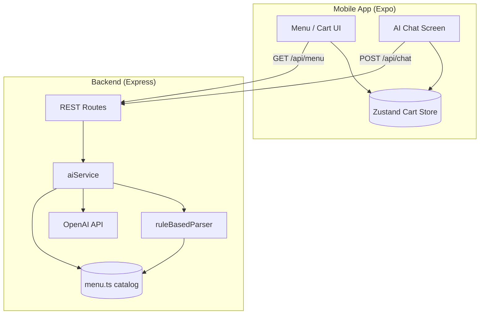

# The Intelligent Bistro

A full-stack mobile ordering experience built for the **Viridien AI Full-Stack Engineering Internship** challenge. Guests browse a curated restaurant menu and manage a live shopping cart through both traditional UI controls and a conversational **AI maître d'** that converts natural language into structured cart operations.

The repository is a **monorepo** with two parts:

| Package | Role | Technology |
|---------|------|------------|
| `backend/` | REST API, NLP / LLM orchestration, menu catalog | Node.js 22, Express 4, TypeScript 5 |
| `mobile/` | Cross-platform client (iOS, Android, web via Expo) | **Expo SDK 54**, React Native 0.81, NativeWind 4 |

> **Note:** Docker runs the **API only**. The Expo app always runs on your machine (or loads in **Expo Go** on your phone) via the Metro bundler.

---

## Table of contents

1. [What this project does](#what-this-project-does)
2. [Recent changes and implementation notes](#recent-changes-and-implementation-notes)
3. [System architecture](#system-architecture)
4. [AI design and specifications](#ai-design-and-specifications)
5. [Data models and cart logic](#data-models-and-cart-logic)
6. [API reference](#api-reference)
7. [Repository structure](#repository-structure)
8. [Quick start](#quick-start)
9. [Running on Expo Go (physical phone)](#running-on-expo-go-physical-phone)
10. [Running on laptop (web browser)](#running-on-laptop-web-browser)
11. [API URL configuration (laptop + phone)](#api-url-configuration-laptop--phone)
12. [OpenAI API key setup and verification](#openai-api-key-setup-and-verification)
13. [Docker](#docker)
14. [Environment variables](#environment-variables)
15. [Development commands](#development-commands)
16. [Troubleshooting](#troubleshooting)
17. [Tech stack summary](#tech-stack-summary)
18. [License](#license)

---

## What this project does

### User-facing capabilities

- **Menu browsing** — Items grouped by category (Mains, Bowls, Drinks, etc.) with descriptions, tags, and prices.
- **Manual cart management** — Add from menu cards; increment, decrement, or remove lines on the Cart tab.
- **AI ordering** — Type or tap suggestions like *"Add two spicy chicken sandwiches and a large water"*; the assistant replies in natural language and returns machine-readable **cart actions** that the app applies automatically.
- **Modifiers** — Size (water), spice level (sandwich), protein add-ons (salad), etc., inferred from text or defaulted sensibly.
- **Premium UI** — Dark bistro palette (gold/cream on charcoal), haptic feedback on native devices, tab navigation, gradient checkout CTA.

### Engineering goals demonstrated

- Separation of **presentation** (mobile) from **intent parsing** (backend).
- **Structured AI output** (JSON actions) rather than free-text-only responses.
- **Graceful degradation** when no cloud LLM key is configured (rule-based parser).
- Production-minded touches: Zod validation, TypeScript throughout, Dockerized API, health checks.

---

## Recent changes and implementation notes

| Area | Detail |
|------|--------|
| **Expo SDK 54** | Upgraded from SDK 52 to match current **Expo Go** on the App Store (SDK 54). |
| **Dual API URLs** | `app.json` uses `apiUrlLocal` (laptop) and `apiUrlDevice` (phone on Wi‑Fi). `src/lib/api.ts` picks the correct URL automatically. |
| **iOS local HTTP** | `NSAllowsLocalNetworking` enabled so Expo Go can call `http://<LAN-IP>:3001`. |
| **Docker + OpenAI** | `docker-compose.yml` loads `backend/.env` only — removed host `OPENAI_API_KEY` override that was wiping the key with an empty value. |
| **Web haptics** | `src/lib/haptics.ts` no-ops on web; native haptics on iOS/Android. |
| **Babel / NativeWind** | SDK 54 uses `nativewind/babel` + Reanimated 4 + `react-native-worklets@0.5.1`. |
| **Menu errors** | Failed API calls show the URL the app tried (helps debug wrong LAN IP). |
| **Session notes** | Extended dev log in [`docs/SESSION_NOTES.md`](docs/SESSION_NOTES.md). |

---

## System architecture

### High-level diagram



### What runs where

| Component | Runs on | Port |
|-----------|---------|------|
| Backend API | Docker **or** `npm run dev` | `3001` |
| Expo Metro / app UI | Your PC (`npx expo start`) | `8081` (default) |
| Expo Go (phone) | Your iPhone/Android | Connects to Metro on PC |

### Why the cart lives on the client

Cart state is in **Zustand** for instant UX. The backend is **stateless** and only receives cart snapshots to improve AI context (e.g. *"what's in my cart?"*).

CORS is enabled with `origin: true` so web and LAN devices can call the API during development.

---

## AI design and specifications

### Mode selection

```
OPENAI_API_KEY present and valid?
  ├─ YES → OpenAI Chat Completions (JSON mode)
  │         └─ on failure → fall back to rule-based parser
  └─ NO  → rule-based parser only
```

`GET /health` returns `"ai": "openai"` or `"ai": "rules"`.  
`POST /api/chat` returns `"parsedBy": "openai"` or `"parsedBy": "rules"`.

### OpenAI (when configured)

| Setting | Value |
|---------|--------|
| Provider | OpenAI (`openai` npm package) |
| Default model | `gpt-4o-mini` (`OPENAI_MODEL`) |
| Temperature | `0.2` |
| Response format | `{ type: "json_object" }` |
| History | Last 6 messages |

### Rule-based parser (fallback)

No API key required. Implemented in `backend/src/services/ruleBasedParser.ts` — handles compound orders, quantities, modifiers, clear cart, menu questions.

---

## Data models and cart logic

### Cart actions (API → client)

| Type | Description |
|------|-------------|
| `ADD` | Add item with optional `modifiers` |
| `REMOVE` | Remove by `itemId` |
| `UPDATE_QUANTITY` | Set quantity for `itemId` |
| `CLEAR` | Empty cart |

Client implementation: `mobile/src/store/cartStore.ts` → `applyActions()`.

---

## API reference

Base URL: `http://localhost:3001` (laptop) or `http://<YOUR_LAN_IP>:3001` (phone)

| Method | Path | Description |
|--------|------|-------------|
| GET | `/health` | Status + AI mode (`openai` / `rules`) |
| GET | `/api/menu` | Full menu |
| POST | `/api/chat` | Parse natural language → `{ reply, actions, parsedBy }` |

Example chat response:

```json
{
  "reply": "Added 2× Spicy Chicken Sandwich (spice: hot), added 1× Still Water (size: large).",
  "actions": [
    { "type": "ADD", "itemId": "spicy-chicken-sandwich", "quantity": 2, "modifiers": { "spice": "hot" } },
    { "type": "ADD", "itemId": "water", "quantity": 1, "modifiers": { "size": "large" } }
  ],
  "parsedBy": "openai",
  "suggestions": ["Add truffle fries", "View cart"]
}
```

---

## Repository structure

```
viridien_project_intelligent_bistro/
├── docker-compose.yml
├── docs/
│   └── SESSION_NOTES.md
├── backend/
│   ├── Dockerfile
│   ├── .env.example          # copy to .env (gitignored)
│   └── src/
│       ├── data/menu.ts
│       ├── services/aiService.ts
│       ├── services/ruleBasedParser.ts
│       └── routes/
└── mobile/
    ├── app.json              # apiUrlLocal + apiUrlDevice
    ├── babel.config.js
    ├── app/(tabs)/           # Menu, AI, Cart
    ├── components/
    └── src/
        ├── lib/api.ts        # URL selection + fetch
        ├── lib/haptics.ts    # Web-safe haptics
        └── store/
```

---

## Quick start

### Prerequisites

| Tool | Purpose |
|------|---------|
| **Node.js 18+** (22 recommended) | Mobile + optional local API |
| **Docker Desktop** (optional) | Containerized API |
| **Expo Go** on your phone | [iOS](https://apps.apple.com/app/expo-go/id982107779) / [Android](https://play.google.com/store/apps/details?id=host.exp.exponent) — must be **SDK 54** |
| Same Wi‑Fi | Phone and PC for Expo Go + LAN API |

### 1. Clone and install

```bash
git clone <your-repo-url>
cd viridien_project_intelligent_bistro

cd backend && npm install && cd ..
cd mobile && npm install && cd ..
```

### 2. Start the API

**Docker:**

```bash
cp backend/.env.example backend/.env
# optional: add OPENAI_API_KEY to backend/.env

docker compose up --build -d
```

**Or local Node:**

```bash
cd backend
cp .env.example .env
npm run dev
```

Verify:

```bash
curl http://localhost:3001/health
```

### 3. Start the mobile app

```bash
cd mobile
npx expo start --clear
```

Then use **Expo Go** (phone) or press **`w`** for web — see sections below.

---

## Running on Expo Go (physical phone)

### Step 1 — Install Expo Go

Install **Expo Go** from the App Store (iOS) or Play Store (Android).  
This project uses **Expo SDK 54** — your Expo Go app must support SDK 54 (current App Store version).

### Step 2 — Configure your PC’s LAN IP

On Windows (PowerShell):

```powershell
ipconfig
```

Find **Wireless LAN adapter Wi‑Fi** → **IPv4 Address** (e.g. `192.168.1.42`).

> **Do not use** VirtualBox (`192.168.56.x`) or Docker-only adapters — your phone cannot reach those.

Edit `mobile/app.json`:

```json
"extra": {
  "apiUrlLocal": "http://localhost:3001",
  "apiUrlDevice": "http://YOUR_WIFI_IPV4:3001"
}
```

Example:

```json
"apiUrlDevice": "http://192.168.1.42:3001"
```

### Step 3 — How the app picks the URL

`mobile/src/lib/api.ts` (uses `expo-device`):

| Environment | URL used |
|-------------|----------|
| Web browser on PC | `apiUrlLocal` → `localhost` |
| **Physical phone** (Expo Go) | `apiUrlDevice` → your LAN IP |
| Android emulator | `http://10.0.2.2:3001` |
| iOS Simulator | `apiUrlLocal` → `localhost` |

### Step 4 — Start Expo and scan QR

```bash
cd mobile
npx expo start --clear
```

1. Phone and PC on the **same Wi‑Fi** (not guest network).
2. Open **Expo Go** → scan the QR code from the terminal.
3. Wait for the bundle to load.

### Step 5 — Verify API from the phone (critical)

On the phone, open **Safari** (iOS) or **Chrome** (Android):

```text
http://YOUR_WIFI_IPV4:3001/health
```

You should see JSON: `{"status":"ok",...}`.

- If Safari **cannot** load this → fix firewall/IP/Wi‑Fi before debugging the app.
- If Safari **can** load it → restart Expo (`--clear`) and reload the app in Expo Go.

### Step 6 — Windows Firewall

Allow inbound **TCP 3001** or allow **Docker Desktop** / **Node.js** on **Private** networks.

### Step 7 — Use the app

1. **Menu** — pull to refresh; items load from API.
2. **AI** — try: `Add two spicy chicken sandwiches and a large water`.
3. **Cart** — confirm lines and totals.

If the menu fails, the error banner shows the **API URL** the app attempted.

---

## Running on laptop (web browser)

Best for quick UI checks on Windows:

```bash
# Terminal 1 — API
docker compose up -d
# or: cd backend && npm run dev

# Terminal 2 — Web
cd mobile
npx expo start --web --clear
```

Open **http://localhost:8081**. The app uses `apiUrlLocal` (`localhost:3001`) automatically.

> Haptics are disabled on web (no crash). Use a physical device to feel haptic feedback.

---

## API URL configuration (laptop + phone)

Set **both** URLs in `mobile/app.json` so you rarely need to switch manually:

```json
"extra": {
  "apiUrlLocal": "http://localhost:3001",
  "apiUrlDevice": "http://192.168.1.42:3001"
}
```

After any `app.json` change:

```bash
npx expo start --clear
```

Reload Expo Go (shake device → **Reload**).

---

## OpenAI API key setup and verification

### Setup

```bash
cp backend/.env.example backend/.env
```

Edit `backend/.env`:

```env
PORT=3001
OPENAI_API_KEY=sk-your-key-here
OPENAI_MODEL=gpt-4o-mini
```

Restart Docker after changes:

```bash
docker compose down && docker compose up -d
```

Logs should show: `AI mode: OpenAI`

### Verify (Git Bash / macOS / Linux)

```bash
# Key loaded?
curl http://localhost:3001/health
# expect: "ai":"openai"

# OpenAI actually used?
curl -s -X POST http://localhost:3001/api/chat \
  -H "Content-Type: application/json" \
  -d '{"message":"Add a large water"}'
# expect: "parsedBy":"openai"
```

### Verify (PowerShell)

```powershell
Invoke-RestMethod http://localhost:3001/health
```

| Result | Meaning |
|--------|---------|
| `"ai":"openai"` | Key is loaded in the running process |
| `"ai":"rules"` | No key in `backend/.env` or container not restarted |
| `"parsedBy":"openai"` on `/api/chat` | OpenAI call succeeded |
| `"parsedBy":"rules"` + offline message in `reply` | Key invalid, billing issue, or API error → fallback |

**Important:** Put the key in **`backend/.env`**, not only a root `.env`. Docker reads `backend/.env` via `env_file`.

---

## Docker

Docker packages **only the backend API**.

```bash
# Build and start
docker compose up --build -d

# Status
docker compose ps

# Logs (follow)
docker compose logs -f api

# Stop
docker compose down
```

### Rebuild when backend code changes

```bash
docker compose up --build -d
```

Mobile changes do **not** require a Docker rebuild — restart Expo only.

### What Docker does not run

The Expo mobile app is **not** in Docker. Run it with `npx expo start` on your host machine.

---

## Environment variables

### Backend (`backend/.env`)

| Variable | Required | Default | Description |
|----------|----------|---------|-------------|
| `PORT` | no | `3001` | HTTP port |
| `OPENAI_API_KEY` | no | — | Enables OpenAI when set |
| `OPENAI_MODEL` | no | `gpt-4o-mini` | Model name |

### Mobile (`mobile/app.json` → `expo.extra`)

| Key | Purpose |
|-----|---------|
| `apiUrlLocal` | Laptop browser / iOS Simulator |
| `apiUrlDevice` | Physical phone on Wi‑Fi (your PC’s IPv4) |

---

## Development commands

### Backend

| Command | Description |
|---------|-------------|
| `npm run dev` | Dev server with hot reload |
| `npm run build` | Compile TypeScript |
| `npm start` | Run `dist/index.js` |

### Mobile

| Command | Description |
|---------|-------------|
| `npx expo start` | Dev server + QR for Expo Go |
| `npx expo start --clear` | Clear Metro cache (use after config changes) |
| `npx expo start --web` | Open in browser |
| `npm run android` | Android emulator |
| `npm run ios` | iOS Simulator (macOS only) |

### Docker

| Command | Description |
|---------|-------------|
| `docker compose up --build -d` | Build + start API |
| `docker compose logs -f api` | Stream logs |
| `docker compose down` | Stop API |

---

## Troubleshooting

| Problem | Likely cause | Fix |
|---------|--------------|-----|
| Expo Go: SDK mismatch | Old project SDK vs new Expo Go | Project is on **SDK 54** — run `cd mobile && npm install` |
| "Could not reach the kitchen API" on phone | Wrong IP in `apiUrlDevice` | Use **Wi‑Fi** IPv4 from `ipconfig`, not VirtualBox `192.168.56.x` |
| Phone browser can't open `/health` | Firewall or different Wi‑Fi | Same network; allow port 3001; disable VPN |
| Web works, phone doesn't | `localhost` on phone = phone itself | Set `apiUrlDevice` to LAN IP |
| `"ai":"rules"` despite `.env` key | Docker not restarted or empty override | `docker compose down && docker compose up -d`; check logs for `AI mode: OpenAI` |
| `parsedBy:"rules"` with key set | Invalid key / no billing | Test key at platform.openai.com; check `docker compose logs api` |
| Web: Metro 500 / MIME error | Babel misconfiguration | Use project's `babel.config.js`; `npx expo start --web --clear` |
| Web: Haptics crash | `expo-haptics` on web | Fixed via `src/lib/haptics.ts` — pull latest |
| Docker pipe error | Docker Desktop not running | Start Docker Desktop |
| Android emulator API | Wrong host | App auto-uses `10.0.2.2:3001` |

### Find your correct Wi‑Fi IP (Windows)

```powershell
ipconfig
```

Use **Wireless LAN adapter Wi‑Fi** → **IPv4 Address**.

### Test from phone browser first

```text
http://<YOUR_WIFI_IPV4>:3001/health
```

---

## Tech stack summary

| Layer | Technologies |
|-------|----------------|
| Mobile | Expo **SDK 54**, React Native **0.81**, React **19**, Expo Router **6**, NativeWind **4** |
| Mobile state | Zustand 5, expo-device, expo-haptics (native only) |
| Backend | Express 4, TypeScript 5, Zod 3, OpenAI SDK |
| AI | `gpt-4o-mini` (optional) + rule-based NLP fallback |
| DevOps | Docker multi-stage build, Docker Compose, health checks |

---

## License

MIT — built for the Viridien AI Full-Stack Engineering internship challenge.
