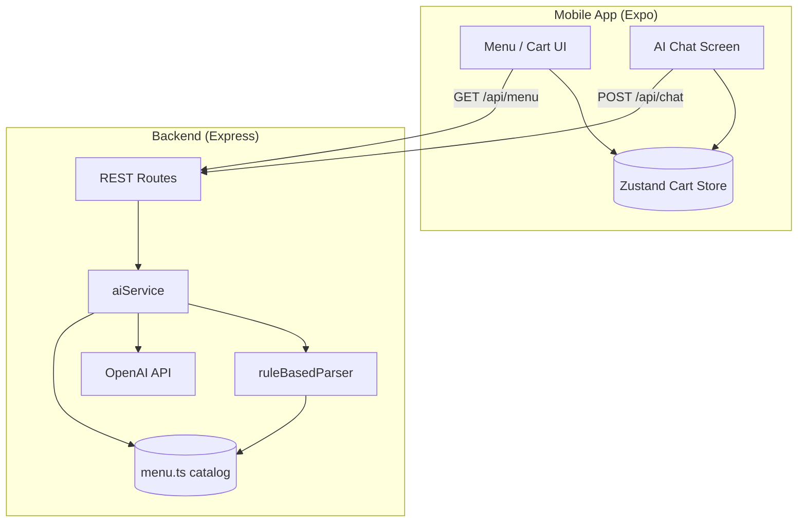

# The Intelligent Bistro

A full-stack mobile ordering experience built for the **Viridien AI Full-Stack Engineering Internship** challenge. Guests browse a curated restaurant menu and manage a live shopping cart through both traditional UI controls and a conversational **AI maître d'** that converts natural language into structured cart operations.

The repository is a **monorepo** with two deployable parts:

| Package | Role | Technology |
|---------|------|------------|
| `backend/` | REST API, NLP / LLM orchestration, menu catalog | Node.js 22, Express 4, TypeScript 5 |
| `mobile/` | Cross-platform client (iOS, Android, web via Expo) | Expo SDK 52, React Native 0.76, NativeWind 4 |

---

## Table of contents

1. [What this project does](#what-this-project-does)
2. [System architecture](#system-architecture)
3. [AI design and specifications](#ai-design-and-specifications)
4. [Data models and cart logic](#data-models-and-cart-logic)
5. [API reference](#api-reference)
6. [Repository structure](#repository-structure)
7. [Getting started (end user setup)](#getting-started-end-user-setup)
   - [Option A: Docker (recommended for API)](#option-a-docker-recommended-for-api)
   - [Option B: Local Node.js (full stack)](#option-b-local-nodejs-full-stack)
8. [Connecting the mobile app to your API](#connecting-the-mobile-app-to-your-api)
9. [Environment variables](#environment-variables)
10. [Development commands](#development-commands)
11. [Troubleshooting](#troubleshooting)
12. [Submission / demo checklist](#submission--demo-checklist)
13. [License](#license)

---

## What this project does

### User-facing capabilities

- **Menu browsing** — Items grouped by category (Mains, Bowls, Drinks, etc.) with descriptions, tags, and prices.
- **Manual cart management** — Add from menu cards; increment, decrement, or remove lines on the Cart tab.
- **AI ordering** — Type or tap suggestions like *"Add two spicy chicken sandwiches and a large water"*; the assistant replies in natural language and returns machine-readable **cart actions** that the app applies automatically.
- **Modifiers** — Size (water), spice level (sandwich), protein add-ons (salad), etc., inferred from text or defaulted sensibly.
- **Premium UI** — Dark bistro palette (gold/cream on charcoal), haptic feedback, tab navigation, gradient checkout CTA.

### Engineering goals demonstrated

- Separation of **presentation** (mobile) from **intent parsing** (backend).
- **Structured AI output** (JSON actions) rather than free-text-only responses.
- **Graceful degradation** when no cloud LLM key is configured (rule-based parser).
- Production-minded touches: Zod validation, TypeScript throughout, Dockerized API, health checks.

---

## System architecture

### High-level diagram



### Request flow: conversational order

1. User sends a message on the **AI** tab (`mobile/app/(tabs)/assistant.tsx`).
2. The client posts to `POST /api/chat` with:
   - `message` — current utterance
   - `history` — last turns (for context when using OpenAI)
   - `cart` — snapshot of current lines and subtotal
3. `aiService.ts` chooses a parsing strategy (see [AI design](#ai-design-and-specifications)).
4. The API returns `{ reply, actions[], suggestions?, parsedBy }`.
5. `cartStore.applyActions()` maps each action to Zustand mutations (`ADD`, `REMOVE`, etc.).
6. The Cart tab and tab-badge count update reactively.

### Request flow: manual menu add

1. User taps **Add to cart** on a menu card.
2. `cartStore.addItem()` runs entirely on-device (no API call).
3. Optional modifiers use defaults from the menu definition (e.g. medium water size).

### Why the cart lives on the client

The challenge requires a **functional shopping cart** with UI and AI control. Cart state is held in **Zustand** for instant UX. The backend is **stateless**: it receives cart context only to improve AI replies (e.g. *"what's in my cart?"*) and does not persist orders. This keeps deployment simple and matches typical mobile commerce patterns.

### Network boundaries

| From | To | Protocol |
|------|-----|----------|
| Expo app | Backend API | HTTP JSON (`fetch`) |
| Backend | OpenAI (optional) | HTTPS via official `openai` SDK |
| Docker host | Container | Published port `3001:3001` |

CORS is enabled with `origin: true` so Expo web and LAN devices can call the API during development.

---

## AI design and specifications

The backend implements a **dual-mode parser**: cloud LLM when configured, otherwise a deterministic **rule-based** engine. Both modes emit the same `CartAction[]` schema so the mobile client never branches on parser type.

### Mode selection

```
OPENAI_API_KEY present and valid?
  ├─ YES → OpenAI Chat Completions (JSON mode)
  │         └─ on failure → fall back to rule-based parser
  └─ NO  → rule-based parser only
```

Health endpoint reports active mode: `"ai": "openai"` or `"ai": "rules"`.

### Mode 1: OpenAI (primary)

| Setting | Value | Notes |
|---------|--------|------|
| **Provider** | OpenAI | Via `openai` npm package v4.x |
| **Default model** | `gpt-4o-mini` | Override with `OPENAI_MODEL` |
| **API surface** | Chat Completions | `openai.chat.completions.create()` |
| **Response format** | `{ type: "json_object" }` | Forces JSON-only assistant output |
| **Temperature** | `0.2` | Low variance for consistent parsing |
| **Max history turns** | Last **6** messages | Prevents unbounded prompt growth |
| **System prompt** | Maître d' persona + full menu catalog | Item ids, modifiers, aliases embedded |
| **Validation** | Zod schemas | `AiResponseSchema`, `CartActionSchema` |
| **Post-processing** | `validateActions()` | Strips actions with unknown `itemId` |

**User message construction** (sent as a single `user` role message):

- Optional conversation block from `history`
- Current `message`
- Optional `cart` JSON summary (item names + quantities)

**Expected JSON shape from the model:**

```json
{
  "reply": "Human-friendly confirmation or clarifying question",
  "actions": [
    {
      "type": "ADD",
      "itemId": "spicy-chicken-sandwich",
      "quantity": 2,
      "modifiers": { "spice": "hot" }
    }
  ],
  "suggestions": ["Add truffle fries", "View cart"]
}
```

**Supported action types** (enforced by Zod):

| Type | Fields | Semantics |
|------|--------|-----------|
| `ADD` | `itemId`, `quantity?`, `modifiers?` | Add units to cart (merge if same item+modifiers) |
| `REMOVE` | `itemId`, `quantity?` | Decrease or remove matching lines |
| `UPDATE_QUANTITY` | `itemId`, `quantity` | Set absolute quantity for matching item |
| `CLEAR` | — | Empty entire cart |
| `SET_MODIFIER` | Reserved in schema | Extensibility for future use |

### Mode 2: Rule-based parser (fallback / offline)

Implemented in `backend/src/services/ruleBasedParser.ts`. No external API calls; suitable for demos, CI, and interviews without API keys.

**Techniques:**

- Normalize and split compound orders (`and`, `,`, `plus`)
- Quantity detection: digits (`2`) and words (`two`, `a`, `couple`)
- Menu matching via item `name` and `aliases[]` (longest substring wins)
- Modifier extraction: keyword scan (`large`, `hot`, `mild`, etc.) against menu modifier options
- Intent handlers: `clear cart`, `show cart`, `menu` / recommendations
- Action deduplication and quantity merging for repeated ADDs

**Example** — Input: `Add two spicy chicken sandwiches and a large water`

| Output field | Value |
|--------------|--------|
| `parsedBy` | `"rules"` |
| `actions[0]` | `ADD spicy-chicken-sandwich ×2, modifiers.spice=hot` |
| `actions[1]` | `ADD water ×1, modifiers.size=large` |

### Cost and latency considerations (OpenAI mode)

- **`gpt-4o-mini`** is chosen for fast, low-cost structured extraction (typical latency ~0.5–2s depending on network).
- Prompt size scales with menu catalog (~11 items) plus ≤6 history messages — intentionally small.
- For production, you would add rate limiting, request IDs, and logging; this repo keeps the surface minimal for clarity.

---

## Data models and cart logic

### Menu item (`MenuItem`)

Defined in `backend/src/data/menu.ts` (11 items). Each has:

- Stable `id` (used in AI actions)
- `name`, `description`, `category`, `price`
- `tags[]` for UI chips
- Optional `modifiers[]` (e.g. size, spice)
- Optional `aliases[]` for NLP matching

### Cart line (`CartLine`) — mobile only

```typescript
{
  lineId: string;      // unique per line (item + modifiers)
  itemId: string;
  name: string;
  quantity: number;
  unitPrice: number;   // base price + modifier deltas
  modifiers: Record<string, string>;
}
```

### Client cart operations (`cartStore.ts`)

| Method | Behavior |
|--------|----------|
| `addItem` | Merge if same `itemId` + modifiers; else new line |
| `removeItem` | Decrement by `lineId`; remove line at 0 |
| `updateQuantity` | Set quantity or remove if ≤ 0 |
| `applyActions` | Apply AI `CartAction[]` batch |
| `clearCart` | Reset lines |
| `subtotal` / `itemCount` | Derived getters |

Modifier defaults: required modifiers (e.g. water `size`) default to `medium` when not specified.

---

## API reference

Base URL (local): `http://localhost:3001`  
Base URL (Docker): same host port mapping `3001`

### `GET /health`

```json
{
  "status": "ok",
  "service": "intelligent-bistro-api",
  "ai": "openai"
}
```

### `GET /api/menu`

Returns `{ items: MenuItem[] }`.

### `GET /api/menu/categories`

Returns `{ categories: string[] }`.

### `POST /api/chat`

**Request body:**

```json
{
  "message": "Add two spicy chicken sandwiches and a large water",
  "history": [
    { "role": "user", "content": "What's popular?" },
    { "role": "assistant", "content": "Our spicy chicken sandwich..." }
  ],
  "cart": {
    "lines": [],
    "subtotal": 0
  }
}
```

| Field | Required | Max | Description |
|-------|----------|-----|-------------|
| `message` | yes | 2000 chars | User utterance |
| `history` | no | — | Prior chat turns |
| `cart` | no | — | Client cart snapshot for context |

**Response:**

```json
{
  "reply": "Added 2× Spicy Chicken Sandwich (spice: hot), added 1× Still Water (size: large).",
  "actions": [
    { "type": "ADD", "itemId": "spicy-chicken-sandwich", "quantity": 2, "modifiers": { "spice": "hot" } },
    { "type": "ADD", "itemId": "water", "quantity": 1, "modifiers": { "size": "large" } }
  ],
  "suggestions": ["Add truffle fries", "View cart", "Remove water"],
  "parsedBy": "rules"
}
```

**Error responses:** `400` validation errors (Zod), `500` unhandled server errors.

---

## Repository structure

```
viridien_project_intelligent_bistro/
├── docker-compose.yml       # One-command API startup
├── .env.example               # Root env template (Docker Compose)
├── README.md
├── backend/
│   ├── Dockerfile             # Multi-stage production image
│   ├── .dockerignore
│   ├── .env.example
│   ├── package.json
│   └── src/
│       ├── index.ts           # Express app entry
│       ├── data/menu.ts       # Canonical menu catalog
│       ├── routes/
│       │   ├── menu.ts
│       │   └── chat.ts
│       ├── services/
│       │   ├── aiService.ts   # OpenAI + routing
│       │   └── ruleBasedParser.ts
│       └── types/index.ts
└── mobile/
    ├── app.json               # Expo config (apiUrl in extra)
    ├── app/
    │   ├── _layout.tsx
    │   └── (tabs)/
    │       ├── index.tsx      # Menu
    │       ├── assistant.tsx  # AI chat
    │       └── cart.tsx
    ├── components/            # UI building blocks
    └── src/
        ├── lib/api.ts         # HTTP client
        └── store/             # Zustand stores
```

---

## Getting started (end user setup)

Follow these steps after cloning the repository from GitHub.

### Prerequisites

| Tool | Version | Purpose |
|------|---------|---------|
| **Git** | any recent | Clone the repo |
| **Docker Desktop** (or Docker Engine + Compose) | 24+ recommended | Run API in container (Option A) |
| **Node.js** | 18+ (22 recommended) | Mobile app and optional local API |
| **npm** | 9+ | Package installs |
| **Expo Go** (phone) or emulator | — | Run the mobile client |

---

### Option A: Docker (recommended for API)

Docker runs only the **backend API**. The Expo mobile app still runs on your machine (or device) because it requires the Metro bundler and Expo Go for the best dev experience.

#### Step 1 — Clone the repository

```bash
git clone https://github.com/YOUR_USERNAME/viridien_project_intelligent_bistro.git
cd viridien_project_intelligent_bistro
```

Replace the URL with your actual GitHub remote.

#### Step 2 — Configure environment (optional OpenAI)

```bash
cp backend/.env.example backend/.env
```

Edit `backend/.env`:

```env
PORT=3001
OPENAI_API_KEY=sk-your-key-here
OPENAI_MODEL=gpt-4o-mini
```

- Leave `OPENAI_API_KEY` empty to use the **rule-based parser** (no external calls).
- Never commit `.env` files (they are gitignored).

Alternatively, for Compose variable substitution from the repo root:

```bash
cp .env.example .env
# Edit OPENAI_API_KEY in .env
```

#### Step 3 — Build and start the API container

```bash
docker compose up --build -d
```

Verify:

```bash
docker compose ps
curl http://localhost:3001/health
```

Expected: `"status":"ok"`.

Stop the API:

```bash
docker compose down
```

View logs:

```bash
docker compose logs -f api
```

#### Step 4 — Run the mobile app

See [Connecting the mobile app](#connecting-the-mobile-app-to-your-api) below, then:

```bash
cd mobile
npm install
npm start
```

Scan the QR code with **Expo Go**.

---

### Option B: Local Node.js (full stack)

Use this if you prefer not to install Docker, or want hot-reload on the API.

#### Step 1 — Clone

Same as Option A, Step 1.

#### Step 2 — Backend

```bash
cd backend
cp .env.example .env
# Edit .env if you want OpenAI
npm install
npm run dev
```

API listens on **http://localhost:3001** with file watching via `tsx`.

Production-style run (compile + node):

```bash
npm run build
npm start
```

#### Step 3 — Mobile (new terminal)

```bash
cd mobile
npm install
npm start
```

---

## Connecting the mobile app to your API

The app reads `expo.extra.apiUrl` from `mobile/app.json` (default `http://localhost:3001`).

| Scenario | `apiUrl` to use |
|----------|-----------------|
| iOS Simulator / Expo web on same PC | `http://localhost:3001` |
| Android Emulator | Auto: `http://10.0.2.2:3001` (handled in `src/lib/api.ts`) |
| Physical phone (same Wi‑Fi as PC) | `http://<YOUR_LAN_IP>:3001` e.g. `http://192.168.1.42:3001` |
| API in Docker on PC, phone on LAN | `http://<YOUR_LAN_IP>:3001` (Docker publishes port to host) |

**To change the URL**, edit `mobile/app.json`:

```json
"extra": {
  "apiUrl": "http://192.168.1.42:3001"
}
```

Restart Expo after changing (`r` in terminal or stop/start `npm start`).

**Firewall:** Allow inbound TCP **3001** on your development machine when testing from a phone.

**Verify connectivity** from the phone browser (optional): open `http://<LAN_IP>:3001/health` — you should see JSON.

---

## Environment variables

### Backend / Docker (`backend/.env` or root `.env`)

| Variable | Required | Default | Description |
|----------|----------|---------|-------------|
| `PORT` | no | `3001` | HTTP listen port |
| `OPENAI_API_KEY` | no | — | Enables OpenAI parsing when set |
| `OPENAI_MODEL` | no | `gpt-4o-mini` | Chat model name |

### Mobile

Configured in `app.json` → `expo.extra.apiUrl` (not via `.env` in this repo).

---

## Development commands

### Backend

| Command | Description |
|---------|-------------|
| `npm run dev` | Dev server with hot reload (`tsx watch`) |
| `npm run build` | Compile TypeScript to `dist/` |
| `npm start` | Run compiled `dist/index.js` |

### Mobile

| Command | Description |
|---------|-------------|
| `npm start` | Start Expo dev server |
| `npm run android` | Open Android emulator |
| `npm run ios` | Open iOS simulator (macOS only) |
| `npm run web` | Run in browser |

### Docker

| Command | Description |
|---------|-------------|
| `docker compose up --build -d` | Build image and start API |
| `docker compose down` | Stop and remove container |
| `docker compose logs -f api` | Stream API logs |

---

## Troubleshooting

| Problem | Likely cause | Fix |
|---------|--------------|-----|
| Mobile shows "Could not reach the kitchen API" | Wrong `apiUrl` or API not running | Start API; set LAN IP on physical device |
| Docker build fails on `npm ci` | Missing lockfile | Run `npm install` in `backend/` and commit `package-lock.json` |
| OpenAI always falls back to rules | Invalid key, billing, or network | Check `OPENAI_API_KEY`; read API logs |
| `parsedBy: "rules"` despite key set | Key not passed into container | Set `backend/.env` or root `.env` for Compose |
| Android emulator can't reach API | Uses wrong host | App uses `10.0.2.2` automatically — don't use `localhost` in `app.json` for emulator |
| Port 3001 in use | Another process | Change `PORT` in `.env` and `docker-compose.yml` port mapping |

---

## Submission / demo checklist

For the Viridien internship Loom (≈5 minutes):

1. **Menu tab** — Categories, add to cart, visual polish.
2. **AI tab** — Natural language order; show cart updating; tap suggestion chips.
3. **Cart tab** — Quantity controls, subtotal/tax, checkout CTA.
4. **Code tour** — `ruleBasedParser.ts`, `aiService.ts`, `cartStore.ts`, `assistant.tsx`.
5. **Setup mention** — Docker `docker compose up`, optional OpenAI key, Expo Go.
6. **Tools** — Cursor / Copilot / etc. used to build the project.

---

## Tech stack summary

| Layer | Technologies |
|-------|----------------|
| Mobile UI | React Native 0.76, Expo 52, Expo Router 4, NativeWind 4, Tailwind CSS 3 |
| Mobile state | Zustand 5 |
| Backend | Express 4, TypeScript 5, Zod 3, dotenv, cors |
| AI | OpenAI Chat Completions (`gpt-4o-mini` default), custom rule-based NLP |
| DevOps | Docker multi-stage build, Docker Compose v2, health checks |

---

## License

MIT — built for the Viridien AI Full-Stack Engineering internship challenge.
