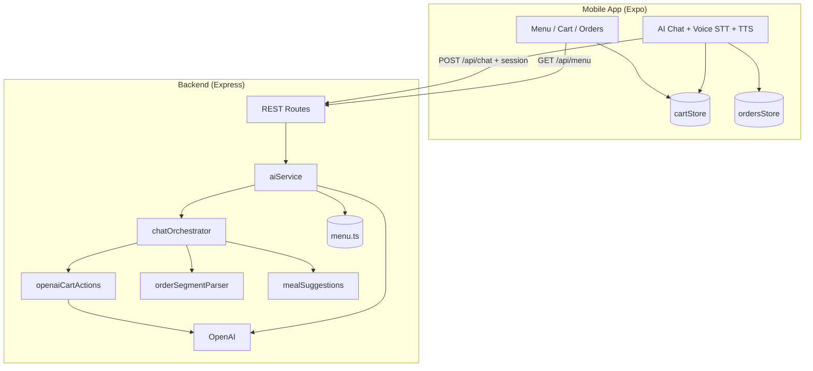
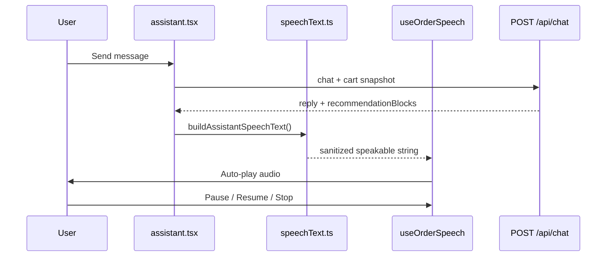

# The Intelligent Bistro

A full-stack mobile ordering experience built for the **Viridien AI Full-Stack Engineering Internship** challenge. Guests browse a curated restaurant menu and manage a live shopping cart through both traditional UI controls and a conversational **AI maître d'** that converts natural language into structured cart operations.

### Project links

- **Project design overview (video):** https://drive.google.com/file/d/1EBBY-bvrmyptlJ_AeMu5Q3dqriygNc_C/view
- **Mobile experience walkthrough (Loom):** https://www.loom.com/share/2b15ba7550ca4d30a38e7081d40c0484

The repository is a **monorepo** with two parts:

| Package | Role | Technology |
|---------|------|------------|
| `backend/` | REST API, NLP / LLM orchestration, menu catalog | Node.js 22, Express 4, TypeScript 5 |
| `mobile/` | Cross-platform client (iOS, Android, web via Expo) | **Expo SDK 54**, React Native 0.81, NativeWind 4 |

> **Note:** Docker runs the **API only**. The Expo app always runs on your machine (or loads in **Expo Go** on your phone) via the Metro bundler.

---

## Table of contents

1. [What this project does](#what-this-project-does)
2. [Latest developments (June 2026)](#latest-developments-june-2026)
3. [Developments (18 May 2026)](#developments-18-may-2026)
4. [Earlier developments (15 May 2026)](#earlier-developments-15-may-2026)
5. [Challenges, solutions, and lessons learned](#challenges-solutions-and-lessons-learned)
6. [Future scope](#future-scope)
7. [Deployment next steps](#deployment-next-steps)
8. [Scalability and production hardening](#scalability-and-production-hardening)
9. [Recent changes and implementation notes](#recent-changes-and-implementation-notes)
10. [System architecture](#system-architecture)
11. [AI design and specifications](#ai-design-and-specifications)
12. [Data models and cart logic](#data-models-and-cart-logic)
13. [API reference](#api-reference)
14. [Repository structure](#repository-structure)
15. [Quick start](#quick-start)
16. [Running on Expo Go (physical phone)](#running-on-expo-go-physical-phone)
17. [Running on laptop (web browser)](#running-on-laptop-web-browser)
18. [Voice input (web + Expo Go)](#voice-input-web--expo-go)
19. [Text-to-speech (read aloud)](#text-to-speech-read-aloud)
20. [API URL configuration (laptop + phone)](#api-url-configuration-laptop--phone)
21. [OpenAI API key setup and verification](#openai-api-key-setup-and-verification)
22. [Docker](#docker)
23. [Environment variables](#environment-variables)
24. [Development commands](#development-commands)
25. [Troubleshooting](#troubleshooting)
26. [Tech stack summary](#tech-stack-summary)
27. [Session notes and documentation](#session-notes-and-documentation)
28. [License](#license)

---

## What this project does

### User-facing capabilities

- **Menu browsing** — **30+ items** across seven categories (Starters, Mains, Bowls, Salads, Sides, Drinks, Desserts), each with **at least four dishes**, descriptions, tags, and prices.
- **Manual cart management** — Add from menu cards with **size selection** (Small / Medium / Large); change size on the Cart tab; increment, decrement, or remove lines.
- **Orders tab** — View placed orders, line items, and totals; cancel from the UI or via chat.
- **AI maître d'** — Natural-language ordering with structured cart and order actions:
  - **Add / remove / update / resize** items with smart quantity and **size** parsing (digits and words: *seven*, *dozen*, *two large waters*, *change burger to small*).
  - **Compound multi-item orders** — *"4 sandwiches and 7 burgers with 3 lemonades"* parsed as separate lines (OpenAI-first when key is set).
  - **Rich menu browse** — Category cards with tappable **Add** rows; multi-category (*"starters and bowls"*).
  - **Cancel orders** — *"Cancel my last order"* actually cancels (does not only list items).
  - **Place order with confirmation** — *"Place order"* shows a full summary → reply **yes** to checkout or **no** to keep editing.
  - **Large quantity guard** — Quantities over **10** of one item are held for confirmation (e.g. add burgers now, confirm 40× water separately).
  - **Category suggestions** — *"What are your bowls?"* / *"Suggestions for desserts"* lists only that category.
  - **Meal coaching** — After adds, suggests pairings; flags missing drinks/sides/desserts in the cart.
  - **Warm greeting** — First visit to the AI tab shows featured dishes and prompts.
- **Voice input (STT)** — **Web:** Edge/Chrome live speech on `localhost:8081`. **Expo Go (iPhone/Android):** record → **Whisper** via `POST /api/transcribe`.
- **Text-to-speech (TTS)** — After every AI reply, the app **reads the full response aloud** automatically (confirmation + pairing suggestions). **Pause**, **resume**, and **stop** controls above the composer. Works on **web**, **Expo Go**, and native builds — on-device, no extra API cost.
- **Modifiers** — **Size on every dish** (category-based price deltas); spice level (sandwich), doneness (burger), etc., inferred from text or defaulted to **Medium**.
- **Premium UI** — Dark bistro palette (gold/cream on charcoal), haptic feedback on native devices, tab navigation (Menu, AI, Cart, Orders).

### Engineering goals demonstrated

- Separation of **presentation** (mobile) from **intent parsing** (backend).
- **Structured AI output** (JSON actions) rather than free-text-only responses.
- **OpenAI-first cart parsing** with rules fallback and **reconcile** anti-hallucination layer; full ordering works without an API key.
- **Automated validation** — `npm run validate:parser` (19 cases) and `npm run validate:ai` (23 cases).
- **Symmetric voice loop** — STT (speech-to-text) in, TTS (text-to-speech) out; both platform-split (`useVoiceInput` / `useOrderSpeech`).
- Production-minded touches: Zod validation, TypeScript throughout, Dockerized API, health checks.

---

## Latest developments (June 2026)

**Text-to-speech**, **Expo Go voice hardening**, and **LAN API auto-detection**.

### Text-to-speech (on-device)

| Layer | Detail |
|-------|--------|
| **Native (iOS/Android/Expo Go)** | `expo-speech` — wraps `AVSpeechSynthesizer` / Android `TextToSpeech` |
| **Web** | Browser **Web Speech Synthesis API** |
| **Architecture** | Platform hooks: `useOrderSpeech.web.ts` / `useOrderSpeech.native.ts` (mirrors `useVoiceInput.*`) |
| **Speech text** | `speechText.ts` — strips markdown/emojis, formats prices, builds cart summaries + recommendation readouts |
| **Auto-play** | Speaks full assistant reply + all `recommendationBlocks` after each user message |
| **Checkout** | Structured cart summary (items, subtotal, tax, total) when `awaitingConfirmation: place_order` |
| **Controls** | Playback bar: **pause** / **resume** / **stop** (chunk-queue pause on Android) |
| **Audio sessions** | `nativeAudioForSpeech.ts` — separate recording vs playback modes (fixes silent TTS after Whisper on Expo Go) |
| **Backend** | None required — TTS is 100% client-side (optional cloud TTS is future scope) |

### Expo Go voice (Whisper) fixes

- Mic stays **tappable** on phone with clear alerts (API unreachable, missing key, permission denied)
- `transcribeAudio.ts` — reliable base64 read via `expo-file-system/legacy`; fetch timeouts; actionable error messages with API URL
- Fresh `/health` check before each recording (`voice: whisper` requires `OPENAI_API_KEY`)
- Fixed stuck “Transcribing…” state when stopping mid-upload

### API URL auto-detection

- `api.ts` derives device API host from **Expo Metro LAN IP** (`debuggerHost` / `hostUri`) so `apiUrlDevice` does not go stale when Wi‑Fi changes
- `apiUrlDevice` in `app.json` remains fallback when auto-detect is unavailable

---

## Developments (18 May 2026)

Final demo polish: **sizes on all dishes**, **OpenAI-first cart parsing**, **iOS chat UI fixes**, **Expo Go voice (Whisper)**, and **cart hallucination** fixes. Full session log: [`docs/SESSION_NOTES_2026-05-18.md`](docs/SESSION_NOTES_2026-05-18.md).

### Size modifiers (every dish)

| Layer | Detail |
|-------|--------|
| **Catalog** | `menuModifiers.ts` — Small / Medium / Large per category with `priceDelta` |
| **Manual UI** | `SizeSelector` on Menu + Cart; live price on `MenuItemCard` |
| **AI** | ADD/REMOVE with size; `SET_MODIFIER` (*change burger to large*); size price Q&A |
| **Default** | Medium when guest does not specify a size |

### OpenAI-first cart parsing

When `OPENAI_API_KEY` is set, cart mutations use a **dedicated parser** (`openaiCartActions.ts`) before rules:

1. GPT-4o (JSON mode, temperature 0) maps the guest message → `CartAction[]`
2. **`reconcileAiCartActions()`** strips hallucinated re-adds of items already in cart
3. Rules parser remains **fallback** and **safety net** for offline / API errors

**Critical fix:** Sending cart context previously caused *"Add lemonade"* to re-add **every cart line**. Reconcile + prompt guardrails now keep only items **named in the current message**.

### Compound orders and *with* clauses

- `expandWithClauses()` — *"7 burgers with 3 lemonades"* → separate add segments
- Validation: `npm run validate:parser` includes multi-item + reconcile cases (**19/19**)

### iOS / Expo Go chat UI

- Removed `flex-1` stretch on chat `ScrollView` content (empty giant cards)
- Recommendation rows: layout on inner `View`; max-height scroll for dish lists
- Text bubble separate from recommendation card — later messages stay visible

### Voice on Expo Go

- `useVoiceInput.native.ts` — record with `expo-av` → `POST /api/transcribe` (Whisper)
- `GET /health` → `"voice": "whisper"` when key is configured

### Validation suite

```bash
cd backend
npm run validate:parser   # 19 tests
npm run validate:ai         # 23 tests
```

---

## Earlier developments (15 May 2026)

Major upgrade to the **AI ordering engine**, **menu catalog**, **order lifecycle**, and **web voice input**. Detailed dev log: [`docs/SESSION_NOTES_2026-05-15.md`](docs/SESSION_NOTES_2026-05-15.md).

### Intelligent AI ordering (structured rules)

The backend runs a **structured chat pipeline** for orders, menu Q&A, and confirmations (OpenAI enriches when rules return null):

| Capability | Example | Behavior |
|------------|---------|----------|
| **Cancel order** | *"Cancel my last order"* | Returns `CANCEL_ORDER`; Orders tab updates — not a line-item dump |
| **Place order** | *"Place order"* → *"yes"* | Full cart summary with tax; client calls `placeOrderFromCart` on confirm |
| **Bulk quantity confirm** | *"Add 40 sparkling waters"* | Items ≤10 add immediately; larger qty needs **yes** / **no** |
| **Category menu Q&A** | *"Suggestions for bowls"* | Lists **only Bowls** (scored detection on inquiry clause) |
| **Compound messages** | *"What are your bowls? Also add 3 sandwiches"* | Menu answer **and** cart adds in one reply |
| **Meal suggestions** | After adding items | Pairing ideas + missing category hints (drink, side, dessert) |
| **Greeting** | Open AI tab / say *"hello"* | Featured dishes from the menu |

**Processing order (rules path):** confirmations → cancel/order list → place-order flow → compound menu+add → cart add → menu inquiry → OpenAI (if key set).

### Expanded menu

- **7 categories**, **4+ items each** (was ~11 items total).
- Rich **aliases** for voice/text (*burger*, *choco lava cake*, *grilled atlantic salmon*, *caesar*, etc.).

### Robust quantity & voice parsing

The rule parser (`orderSegmentParser.ts` + `messageNormalizer.ts`) handles:

- Word numbers: *seven*, *four*, *dozen*, *half dozen*
- Trailing qty: *bruschetta 3 in quantity*, *of quantity 6*
- Voice glitches: `add.4` → `add 4`, `fries.and also` → split correctly
- Phrases: *to be added to the cart*, *along with that also add*
- **No phantom items** — stopwords and word-boundary matching (e.g. `"and"` no longer matches *sandwich*)

### Session-aware chat API

Multi-turn confirmations persist via `sessionContext`:

```json
{
  "session": {
    "awaitingConfirmation": "place_order",
    "pendingActions": []
  }
}
```

Response may include `placeOrderFromCart: true` and updated `sessionContext`.

### Voice on web (Edge / Chrome)

- Web Speech API in `mobile/src/lib/webSpeechRecognition.ts`
- **Microsoft Edge** and **Chrome** on desktop; use **`http://localhost:8081`** (mic blocked on raw LAN IP URLs)
- Serialized stop/start, auto-reconnect on transient errors

---

## Challenges, solutions, and lessons learned

| Challenge | Symptom | Solution |
|-----------|---------|----------|
| **iOS chat layout** | Starter / recommendation card filled the screen; messages hidden | No `flexGrow` on scroll content; `flexGrow: 0` on bubbles; nested scroll + inner `View` row layout |
| **OpenAI cart hallucination** | *"Add lemonade"* re-added every item already in cart | Cart context marked read-only in prompt; `reconcileAiCartActions()` vs rules parser |
| **With-clause parsing** | *"7 burgers with 3 lemonades"* → 7 lemonades, burgers skipped | `expandWithClauses()` + OpenAI examples + reconcile tests |
| **Rules before OpenAI** | Complex orders failed despite API key | `resolveCartActions()` — OpenAI first, rules fallback |
| **Expo Go voice** | No Web Speech on device | Native record → `POST /api/transcribe` (Whisper) |
| **Pressable on iOS** | Add buttons stacked as full-width bars | Layout styles on child `View`, not on `Pressable` |

**Lesson:** Always **cross-check** LLM cart output against deterministic rules for the **current message only** — never trust cart snapshot context as implicit ADD intent.

---

## Future scope

- **Payments** — Stripe / Apple Pay after place-order confirmation
- **Kitchen display** — Real-time order queue for staff (WebSocket)
- **Accounts** — Server-side cart, order history, favorites
- **Rich modifiers** — Toppings, allergies, special instructions
- **Analytics** — Parse success rates, popular pairings, voice vs text
- **i18n** — Multi-language menu and prompts
- **Cloud TTS** — Optional OpenAI/ElevenLabs voice for branded maître d' (on-device TTS ships today)
- **Embedding search** — Fuzzy menu match when catalog grows beyond ~100 items

---

## Deployment next steps

### 1. Backend (API)

1. Build and push Docker image to your registry (Fly.io, Railway, Render, AWS ECS, Azure Container Apps).
2. Set production secrets: `OPENAI_API_KEY`, `OPENAI_MODEL` (recommend **`gpt-4o`** for demo accuracy).
3. Expose **HTTPS**; restrict CORS to your app origin (replace dev `origin: true`).
4. Smoke test: `GET /health`, `POST /api/chat`, `POST /api/transcribe`.

### 2. Mobile

1. Configure production API URL in `app.json` / EAS secrets (not `localhost`).
2. `eas build --platform ios` / `android` for TestFlight or internal testing.
3. Optional: `npx expo export --platform web` for browser kiosk demo.

### 3. CI / quality gate

```bash
cd backend && npm run build && npm run validate:parser && npm run validate:ai
cd mobile && npx tsc --noEmit
```

### 4. Operations

- Log `parsedBy`, latency, and OpenAI errors
- Rate-limit `/api/chat` and `/api/transcribe`
- Monitor OpenAI spend and set billing alerts

---

## Scalability and production hardening

| Area | MVP (now) | Scale path |
|------|-----------|------------|
| **API** | Single Node container, stateless | Horizontal replicas behind load balancer |
| **State** | Cart/orders on client; session hints in request | Redis + user accounts + server cart |
| **Menu** | In-memory TypeScript catalog | CMS / PostgreSQL + CDN cache |
| **AI cart** | Sync OpenAI per message | Queue workers; cache category browse; tiered models |
| **Voice (STT)** | Whisper per upload | Streaming STT; upload size limits |
| **TTS** | On-device (`expo-speech` / Web Speech Synthesis) | Optional `speechText` from API; cloud TTS for brand voice |
| **Parsing** | Rules + reconcile + OpenAI | CI golden tests; shadow-mode parser comparison |
| **Mobile** | Expo Go / dev builds | EAS production + OTA for UI-only updates |

The API is **stateless** today — scaling out is mostly duplicate containers + shared secrets. Add sticky sessions only if server-side chat state moves off the client.

---

## Recent changes and implementation notes

| Area | Detail |
|------|--------|
| **TTS (June 2026)** | `useOrderSpeech.*.ts`, `speechText.ts`, `nativeAudioForSpeech.ts`, `orderSpeechUi.ts` |
| **TTS UX** | Auto-read assistant replies + recommendations; pause/resume/stop bar in AI tab |
| **API LAN detect** | `getApiBaseUrl()` uses Expo `debuggerHost` on physical devices |
| **Voice hardening** | `transcribeAudio.ts` legacy base64, health checks, Expo Go mic always tappable |
| **Sizes** | `menuModifiers.ts`, `sizeParser.ts`, `SizeSelector.tsx`, `SET_MODIFIER` |
| **OpenAI cart** | `openaiCartActions.ts`, `reconcileAiCartActions()` |
| **Structured chat** | `chatOrchestrator.ts` (async), `mealSuggestions.ts`, `menuBrowseResolver.ts` |
| **Orders on client** | Zustand `ordersStore`; AI cancel + place-order flows |
| **Menu ~30 items** | `backend/src/data/menu.ts` — 4+ per category, all with size options |
| **Expo SDK 54** | Matches current **Expo Go** on the App Store |
| **Dual API URLs** | `apiUrlLocal` + `apiUrlDevice` in `app.json`; LAN auto-detect in `api.ts` |
| **Docker + OpenAI** | `env_file: backend/.env` — no empty host override for `OPENAI_API_KEY` |
| **Voice (STT)** | Web Speech (desktop) + Whisper transcribe (Expo Go) |
| **Chat UI (iOS)** | `ChatBubble.tsx`, `RecommendationBlocks.tsx` layout fixes |
| **Validation** | `validate-order-parser.ts` (19), `validate-ai.ts` (23) |
| **Session notes** | [18 May](docs/SESSION_NOTES_2026-05-18.md) · [15 May](docs/SESSION_NOTES_2026-05-15.md) · [Inception](docs/SESSION_NOTES.md) |

---

## System architecture

### High-level diagram



### What runs where

| Component | Runs on | Port |
|-----------|---------|------|
| Backend API | Docker **or** `npm run dev` | `3001` |
| Expo Metro / app UI | Your PC (`npx expo start`) | `8081` (default) |
| Expo Go (phone) | Your iPhone/Android | Connects to Metro on PC |
| Web Speech (mic) | Desktop **Edge / Chrome** | Via `localhost:8081` |
| Expo Go voice | iPhone / Android | Record → `POST /api/transcribe` |

### Client-side state

| Store | Purpose |
|-------|---------|
| `cartStore` | Live cart lines, `applyActions()` from AI |
| `ordersStore` | Placed/cancelled orders, `placeOrderFromCart()`, `applyOrderActions()` |
| `menuStore` | Cached menu from API |

The backend is **stateless** except for optional **chat session** hints (`awaitingConfirmation`, `pendingActions`) sent by the client each request. Cart and order **snapshots** are included in chat requests for context.

CORS is enabled with `origin: true` so web and LAN devices can call the API during development.

---

## AI design and specifications

### Request flow

```
POST /api/chat
  ├─ Greeting (hello, empty history)? → getGreetingReply()
  ├─ handleStructuredChat()  ← async
  │     ├─ Session yes/no (place_order | bulk_add)
  │     ├─ Cancel / list / detail orders
  │     ├─ Place order → summary + await yes
  │     ├─ Compound: menu question + cart add
  │     ├─ Cart add → resolveCartActions()
  │     │     ├─ OPENAI_API_KEY? → openaiCartActions + reconcileAiCartActions
  │     │     └─ else → orderSegmentParser (rules)
  │     └─ Menu inquiry (category, blocks, meal gaps)
  └─ If null && OPENAI_API_KEY → OpenAI general JSON chat
        └─ on failure → rules fallback
```

`GET /health` → `"ai": "openai"` or `"ai": "rules"`.  
`POST /api/chat` → `"parsedBy": "openai"` or `"parsedBy": "rules"`.

### Structured chat (`chatOrchestrator.ts`)

| Feature | Trigger | Result |
|---------|---------|--------|
| **Place order confirm** | `place order` → user says `yes` | `placeOrderFromCart: true`, cart cleared, order in Orders tab |
| **Bulk add confirm** | Any single item qty **> 10** | Immediate adds for normal lines; large qty in `pendingActions` until `yes` |
| **Cancel** | `cancel my last order`, `cancel order #1001` | `orderActions: [{ type: "CANCEL_ORDER", ... }]` |
| **Order detail** | `what's in my last order` (not cancel) | Formatted line items from client snapshot |
| **Category list** | `suggestions for bowls`, `what are your desserts` | Scored category match via `mealSuggestions.ts` |
| **Pairing / gaps** | After cart add | Combo ideas + missing drink/side/dessert |

`HIGH_QUANTITY_THRESHOLD = 10` (configurable in `chatOrchestrator.ts`).

### Natural-language parsing (`orderSegmentParser.ts`)

Handles messy voice and chat text without OpenAI:

- **Segments:** split on `and`, `,`, `.` — not on `with` inside *along with*
- **Quantities:** leading (`4 burgers`), trailing (`bruschetta 3 in quantity`), words (`seven`, `dozen`)
- **Normalization:** `add.4` → `add 4`, `and also add`, `added to cart`, `along with that`
- **Matching:** word-boundary menu match; ignores stopwords (`and`, `along`, `that`)
- **Modifiers:** water size, sandwich spice, etc.

### OpenAI (when configured)

| Setting | Value |
|---------|--------|
| Provider | OpenAI (`openai` npm package) |
| Default model | `gpt-4o` (`OPENAI_MODEL`; override in `.env`) |
| Cart parse | Dedicated pass — temperature **0**, JSON actions |
| General chat | Temperature `0.2` when structured path returns null |
| Reconcile | `reconcileAiCartActions()` after every OpenAI cart response |

OpenAI is the **primary cart parser** when a key is set; rules handle menu browse, place/cancel, confirmations, and offline fallback.

### Example phrases

| You say | Expected behavior |
|---------|-------------------|
| `Cancel my last order` | Order cancelled in Orders tab |
| `Place order` → `yes` | Order placed from cart |
| `Suggestions for bowls` | Lists all bowl items only |
| `Add 3 truffle fries and tomato bruschetta of quantity 6` | 3× fries, 6× bruschetta |
| `seven spicy chicken sandwiches` | 7× sandwich |
| `add four sandwiches and seven burgers with three lemonades` | 4 + 7 + 3 (separate items) |
| `Add Craft Lavender Lemonade` (cart non-empty) | **Only** lemonade added |
| `Add two large sparkling waters` | 2× Large water |
| `Change my burger to small` | Size updated on burger line |
| `Add 40 sparkling water` | Confirms bulk qty; other items add immediately |
| `What are bowls? Also add 2 soup` | Bowl list + 2× soup in cart |

---

## Data models and cart logic

### Cart actions (API → client)

| Type | Description |
|------|-------------|
| `ADD` | Add item with optional `modifiers` (e.g. `size: small\|medium\|large`) |
| `REMOVE` | Remove by `itemId` (+ optional size modifier match) |
| `UPDATE_QUANTITY` | Set quantity for `itemId` |
| `SET_MODIFIER` | Change size/options on an existing cart line |
| `CLEAR` | Empty cart |

### Order actions (API → client)

| Type | Description |
|------|-------------|
| `CANCEL_ORDER` | Cancel by `orderId` or `orderNumber` (defaults to latest placed) |
| `CANCEL_ALL_ORDERS` | Cancel all placed orders |

### Chat session (optional, client ↔ server)

| Field | Values | Purpose |
|-------|--------|---------|
| `awaitingConfirmation` | `place_order` \| `bulk_add` \| `null` | Multi-turn yes/no |
| `pendingActions` | `CartAction[]` | Large qty holds until confirmed |

### Client flags

| Field | When set | Client behavior |
|-------|----------|-----------------|
| `placeOrderFromCart` | User confirmed place order | `ordersStore.placeOrderFromCart()` |

Implementations: `cartStore.applyActions()`, `ordersStore.applyOrderActions()`, `assistant.tsx` persists `sessionContext`.

Tax on client: **8%** on subtotal (cart and placed orders).

---

## API reference

Base URL: `http://localhost:3001` (laptop) or `http://<YOUR_LAN_IP>:3001` (phone)

| Method | Path | Description |
|--------|------|-------------|
| GET | `/health` | Status + AI mode (`openai` / `rules`) + voice (`whisper` if configured) |
| GET | `/api/menu` | Full menu (includes size modifiers) |
| POST | `/api/chat` | Natural language → reply, actions, orders, session, `recommendationBlocks` |
| POST | `/api/transcribe` | Audio upload → text (Whisper; requires OpenAI key) |

#### `POST /api/chat` request body

```json
{
  "message": "Add 3 truffle parmesan fries and tomato bruschetta of quantity 6",
  "history": [{ "role": "user", "content": "..." }, { "role": "assistant", "content": "..." }],
  "cart": {
    "lines": [{ "lineId": "...", "itemId": "...", "name": "...", "quantity": 1, "unitPrice": 7.5, "modifiers": {} }],
    "subtotal": 7.5
  },
  "orders": [{ "id": "...", "orderNumber": 1001, "status": "placed", "total": 42.5, "itemCount": 3, "createdAt": 0, "lines": [] }],
  "session": {
    "awaitingConfirmation": null,
    "pendingActions": []
  }
}
```

#### Example response (cart add)

```json
{
  "reply": "I've added 3× Truffle Parmesan Fries, 6× Tomato Bruschetta.\n\nWhat would you like with your order? These pair nicely:\n• ...",
  "actions": [
    { "type": "ADD", "itemId": "truffle-fries", "quantity": 3 },
    { "type": "ADD", "itemId": "tomato-bruschetta", "quantity": 6 }
  ],
  "orderActions": [],
  "parsedBy": "rules",
  "sessionContext": { "awaitingConfirmation": null },
  "suggestions": ["Place order", "View cart", "Add truffle fries"]
}
```

#### Example response (place order — awaiting yes)

```json
{
  "reply": "Here's your order summary:\n\n1. 3× Truffle Parmesan Fries — $22.50\n...\n\nReply **yes** to place this order, or **no** to keep editing your cart.",
  "actions": [],
  "sessionContext": { "awaitingConfirmation": "place_order" },
  "suggestions": ["Yes", "No", "View cart"],
  "parsedBy": "rules"
}
```

#### Example response (after user says `yes` to place order)

```json
{
  "reply": "Wonderful — your order is placed!...",
  "actions": [],
  "placeOrderFromCart": true,
  "sessionContext": { "awaitingConfirmation": null },
  "parsedBy": "rules"
}
```

---

## Repository structure

```
viridien_project_intelligent_bistro/
├── docker-compose.yml
├── docs/
│   ├── SESSION_NOTES.md
│   ├── SESSION_NOTES_2026-05-18.md   # Sizes, OpenAI cart, iOS UI, reconcile
│   └── SESSION_NOTES_2026-05-15.md   # Structured chat, web voice, parsing
├── backend/
│   ├── Dockerfile
│   ├── .env.example
│   └── src/
│       ├── data/menu.ts, menuModifiers.ts
│       ├── services/
│       │   ├── aiService.ts
│       │   ├── chatOrchestrator.ts
│       │   ├── openaiCartActions.ts  # OpenAI-first cart parse
│       │   ├── openaiMenuIntent.ts
│       │   ├── menuBrowseResolver.ts
│       │   ├── sizeParser.ts
│       │   ├── mealSuggestions.ts
│       │   ├── menuInquiry.ts
│       │   ├── messageNormalizer.ts
│       │   ├── orderSegmentParser.ts # reconcileAiCartActions
│       │   ├── orderParser.ts
│       │   └── transcribeService.ts
│       ├── routes/menu.ts, chat.ts, transcribe.ts
│       └── scripts/validate-ai.ts, validate-order-parser.ts
│       └── types/index.ts
└── mobile/
    ├── app.json
    ├── app/(tabs)/                   # Menu, AI, Cart, Orders
    └── src/
        ├── lib/api.ts, speechText.ts, nativeAudioForSpeech.ts, orderSpeechUi.ts
        ├── lib/webSpeechRecognition.ts, transcribeAudio.ts, voiceUi.ts, menuModifiers.ts
        ├── hooks/useVoiceInput.web.ts, useVoiceInput.native.ts
        ├── hooks/useOrderSpeech.web.ts, useOrderSpeech.native.ts
        ├── components/SizeSelector.tsx, RecommendationBlocks.tsx, ChatBubble.tsx
        └── store/cartStore.ts, ordersStore.ts, menuStore.ts
```

---

## Quick start

### Prerequisites

| Tool | Purpose |
|------|---------|
| **Node.js 18+** (22 recommended) | Mobile + optional local API |
| **Docker Desktop** (optional) | Containerized API |
| **Expo Go** on your phone | [iOS](https://apps.apple.com/app/expo-go/id982107779) / [Android](https://play.google.com/store/apps/details?id=host.exp.exponent) — must be **SDK 54** |
| Same Wi‑Fi | Phone and PC for Expo Go + LAN API |

### 1. Clone and install

```bash
git clone <your-repo-url>
cd viridien_project_intelligent_bistro

cd backend && npm install && cd ..
cd mobile && npm install && cd ..
```

### 2. Start the API

**Docker:**

```bash
cp backend/.env.example backend/.env
# optional: add OPENAI_API_KEY to backend/.env

docker compose up --build -d
```

**Or local Node:**

```bash
cd backend
cp .env.example .env
npm run dev
```

Verify:

```bash
curl http://localhost:3001/health
```

### 3. Start the mobile app

```bash
cd mobile
npx expo start --clear
```

Then use **Expo Go** (phone) or press **`w`** for web — see sections below.

---

## Running on Expo Go (physical phone)

### Step 1 — Install Expo Go

Install **Expo Go** from the App Store (iOS) or Play Store (Android).  
This project uses **Expo SDK 54** — your Expo Go app must support SDK 54 (current App Store version).

### Step 2 — Configure your PC’s LAN IP

On Windows (PowerShell):

```powershell
ipconfig
```

Find **Wireless LAN adapter Wi‑Fi** → **IPv4 Address** (e.g. `192.168.1.42`).

> **Do not use** VirtualBox (`192.168.56.x`) or Docker-only adapters — your phone cannot reach those.

Optionally set a fallback in `mobile/app.json` (auto-detect usually picks the right LAN IP):

```json
"extra": {
  "apiUrlLocal": "http://localhost:3001",
  "apiUrlDevice": "http://YOUR_WIFI_IPV4:3001"
}
```

Example: `"apiUrlDevice": "http://192.168.1.42:3001"`

### Step 3 — How the app picks the URL

`mobile/src/lib/api.ts` (uses `expo-device` + Expo LAN host auto-detect):

| Environment | URL used |
|-------------|----------|
| Web browser on PC | `apiUrlLocal` → `localhost` |
| **Physical phone** (Expo Go) | Auto: same LAN IP as Metro (`debuggerHost`); fallback `apiUrlDevice` |
| Android emulator | `http://10.0.2.2:3001` |
| iOS Simulator | `apiUrlLocal` → `localhost` |

### Step 4 — Start Expo and scan QR

```bash
cd mobile
npx expo start --clear --lan
```

1. Phone and PC on the **same Wi‑Fi** (not guest network).
2. Open **Expo Go** → scan the QR code from the terminal.
3. Wait for the bundle to load.

### Step 5 — Verify API from the phone (critical)

On the phone, open **Safari** (iOS) or **Chrome** (Android):

```text
http://YOUR_WIFI_IPV4:3001/health
```

You should see JSON: `{"status":"ok",...}`.

- If Safari **cannot** load this → fix firewall/IP/Wi‑Fi before debugging the app.
- If Safari **can** load it → restart Expo (`--clear`) and reload the app in Expo Go.

### Step 6 — Windows Firewall

Allow inbound **TCP 3001** or allow **Docker Desktop** / **Node.js** on **Private** networks.

### Step 7 — Use the app

1. **Menu** — pull to refresh; items load from API.
2. **AI** — try: `Add two spicy chicken sandwiches and a large water` — response is **read aloud** automatically.
3. **Voice** — tap **mic** → speak → tap **stop** → edit transcript → **send** (requires `voice: whisper` in `/health`).
4. **TTS controls** — use **pause** / **play** / **stop** on the bar above the composer while audio plays.
5. **Cart** — confirm lines and totals.

If the menu fails, the error banner shows the **API URL** the app attempted.

---

## Running on laptop (web browser)

Best for quick UI checks on Windows:

```bash
# Terminal 1 — API
docker compose up -d
# or: cd backend && npm run dev

# Terminal 2 — Web
cd mobile
npx expo start --web --clear
```

Open **http://localhost:8081** (or `--port 8082` if 8081 is in use). The app uses `apiUrlLocal` (`localhost:3001`) automatically.

```bash
npx expo start --web --clear --port 8082   # if port 8081 is busy
```

> Haptics are disabled on web (no crash). Use a physical device to feel haptic feedback. **Voice input and TTS work on web** — see sections below.

---

## Voice input (web + Expo Go)

### Web — Edge / Chrome (live speech)

Voice ordering on desktop uses the browser **Web Speech API**.

### Requirements

| Requirement | Detail |
|-------------|--------|
| Browser | **Microsoft Edge** or **Google Chrome** on desktop |
| URL | **`http://localhost:8081`** — use `npx expo start --web` |
| Microphone | Allow when prompted (lock icon → Site permissions → Microphone) |
| API | `http://localhost:3001` running (Docker or `npm run dev`) |

> **Do not** open the app via `http://192.168.x.x:8081` for voice — Edge blocks the microphone on non-secure LAN URLs. Use **localhost** on the same PC running Expo.

### How to use

1. `cd mobile && npx expo start --web --clear`
2. Open **http://localhost:8081** in Edge
3. Go to **AI** tab → tap the **mic** → speak → tap **stop**
4. Edit the transcript if needed → send

### Behavior

- Live transcript appears in the text field while speaking
- After **stop**, wait ~1 second before tapping **mic** again (session cooldown for Edge)
- Status: *Listening…*, *Still listening — reconnecting…*, or inline error if mic blocked
### Expo Go — iPhone / Android (Whisper)

1. Ensure `OPENAI_API_KEY` is set in `backend/.env` and restart Docker.
2. Confirm `/health` shows `"voice": "whisper"` (not `"rules-only"`).
3. Phone and PC on the **same Wi‑Fi**; test `http://<PC_IP>:3001/health` in the phone browser.
4. Start Expo with LAN: `npx expo start --clear --lan`
5. On the **AI** tab, tap **mic** → speak → tap **stop** → wait for *Transcribing…* → transcript appears → **send**.

Implementation: `useVoiceInput.native.ts` records with `expo-av` → base64 via `expo-file-system/legacy` → `POST /api/transcribe` (OpenAI Whisper).

> **Mic permission:** iOS Settings → Expo Go → Microphone → Allow.

### Troubleshooting voice (STT)

| Symptom | Fix |
|---------|-----|
| Mic grayed out on **web** | Use Edge/Chrome on **localhost:8081** only |
| Mic tap shows “needs OPENAI_API_KEY” | Add key to `backend/.env`; `docker compose up --build -d`; verify `voice: whisper` |
| Network request timeout on phone | Wrong/stale IP — use `npx expo start --lan`; test `/health` in phone browser |
| “Recording file not found” | Pull latest `transcribeAudio.ts` (legacy FileSystem); reload Expo Go |
| Stuck on “Transcribing…” | Tap mic again to reset; check API reachable from phone |
| Mic blocked on LAN IP (web) | Use **http://localhost:8081** on PC |
| Stuck on “reconnecting” (web) | Tap stop, wait 2s, tap mic again; hard refresh (`Ctrl+Shift+R`) |
| “Voice service unavailable” (web) | Check internet (Edge uses cloud speech); retry |

---

## Text-to-speech (read aloud)

Guests **hear** every AI response automatically — closing the loop with voice input (speak → verify by listening).

### What gets read

| Trigger | Spoken content |
|---------|----------------|
| **Any AI reply** | Main confirmation text + all recommendation block titles, dish names, prices, and notes |
| **Place order** | Structured cart summary: line items, subtotal, 8% tax, total, yes/no prompt |
| **Bulk quantity confirm** | Sanitized confirmation message |
| **Order placed** | Success message |
| **API error** | Server unreachable message (if TTS available) |

### Playback controls

A bar above the composer shows while audio is active:

- **Pause** — pause mid-readout
- **Play** — resume from where you left off
- **Stop (×)** — dismiss playback entirely

Sending a new message or tapping the **mic** stops playback (avoids mic/speaker conflict).

### Platform implementation

| Platform | Engine | Package |
|----------|--------|---------|
| **iOS / Android / Expo Go** | Native OS TTS | `expo-speech` |
| **Web** | Web Speech Synthesis | Browser built-in |
| **Pause/resume** | Native pause on iOS + web; chunk-queue pause on Android | `useOrderSpeech.native.ts` |

### Architecture (client-only)



Key files:

- `mobile/src/lib/speechText.ts` — markdown strip, price formatting, cart summary, chunking for Android limits
- `mobile/src/hooks/useOrderSpeech.web.ts` / `.native.ts` — platform TTS + queue
- `mobile/src/lib/nativeAudioForSpeech.ts` — audio session for recording vs playback
- `mobile/app/(tabs)/assistant.tsx` — wires auto-speak after each reply

### TTS troubleshooting

| Symptom | Fix |
|---------|-----|
| No audio on **iPhone** | Turn off hardware **silent switch**; raise volume |
| No audio after using **mic** | Fixed in latest code — `prepareNativeAudioForSpeech()` after Whisper; reload app |
| Audio cuts off on long replies | Automatic chunking at sentence boundaries (`chunkTextForSpeech`) |
| Want to silence readout | Tap **stop (×)** on playback bar before next message |

---

## API URL configuration (laptop + phone)

Set **both** URLs in `mobile/app.json` as fallback:

```json
"extra": {
  "apiUrlLocal": "http://localhost:3001",
  "apiUrlDevice": "http://192.168.1.42:3001"
}
```

**On Expo Go (physical phone),** `api.ts` **auto-derives** the API host from the same LAN IP Metro uses (`debuggerHost`), so you usually only need to update `apiUrlDevice` when auto-detect fails.

| Environment | URL used |
|-------------|----------|
| Web on PC | `apiUrlLocal` → `localhost:3001` |
| **Expo Go on phone** | Auto: `http://<metro-lan-ip>:3001` (fallback: `apiUrlDevice`) |
| Android emulator | `http://10.0.2.2:3001` |
| iOS Simulator | `apiUrlLocal` → `localhost:3001` |

After any `app.json` change:

```bash
npx expo start --clear --lan
```

Reload Expo Go (shake device → **Reload**).

---

## OpenAI API key setup and verification

### Setup

```bash
cp backend/.env.example backend/.env
```

Edit `backend/.env`:

```env
PORT=3001
OPENAI_API_KEY=sk-your-key-here
OPENAI_MODEL=gpt-4o-mini
```

Restart Docker after changes:

```bash
docker compose down && docker compose up -d
```

Logs should show: `AI mode: OpenAI`

### Verify (Git Bash / macOS / Linux)

```bash
# Key loaded?
curl http://localhost:3001/health
# expect: "ai":"openai"

# OpenAI actually used?
curl -s -X POST http://localhost:3001/api/chat \
  -H "Content-Type: application/json" \
  -d '{"message":"Add a large water"}'
# expect: "parsedBy":"openai"
```

### Verify (PowerShell)

```powershell
Invoke-RestMethod http://localhost:3001/health
```

| Result | Meaning |
|--------|---------|
| `"ai":"openai"` | Key is loaded in the running process |
| `"ai":"rules"` | No key in `backend/.env` or container not restarted |
| `"voice":"whisper"` | Whisper transcription enabled (required for Expo Go mic) |
| `"voice":"rules-only"` | No key — voice input on Expo Go will show setup instructions |
| `"parsedBy":"openai"` on `/api/chat` | OpenAI call succeeded |
| `"parsedBy":"rules"` + offline message in `reply` | Key invalid, billing issue, or API error → fallback |

**Important:** Put the key in **`backend/.env`**, not only a root `.env`. Docker reads `backend/.env` via `env_file`.

---

## Docker

Docker packages **only the backend API**.

```bash
# Build and start
docker compose up --build -d

# Status
docker compose ps

# Logs (follow)
docker compose logs -f api

# Stop
docker compose down
```

### Rebuild when backend code changes

```bash
docker compose up --build -d
```

Mobile changes do **not** require a Docker rebuild — restart Expo only.

### What Docker does not run

The Expo mobile app is **not** in Docker. Run it with `npx expo start` on your host machine.

---

## Environment variables

### Backend (`backend/.env`)

| Variable | Required | Default | Description |
|----------|----------|---------|-------------|
| `PORT` | no | `3001` | HTTP port |
| `OPENAI_API_KEY` | no | — | Enables OpenAI when set |
| `OPENAI_MODEL` | no | `gpt-4o` | Model for cart + chat + Whisper |

### Mobile (`mobile/app.json` → `expo.extra`)

| Key | Purpose |
|-----|---------|
| `apiUrlLocal` | Laptop browser / iOS Simulator |
| `apiUrlDevice` | Physical phone on Wi‑Fi (your PC’s IPv4) |

---

## Development commands

### Backend

| Command | Description |
|---------|-------------|
| `npm run dev` | Dev server with hot reload |
| `npm run build` | Compile TypeScript |
| `npm start` | Run `dist/index.js` |
| `npm run validate:parser` | 19 cart-parser + reconcile tests |
| `npm run validate:ai` | 23 structured-chat tests |

### Mobile

| Command | Description |
|---------|-------------|
| `npx expo start` | Dev server + QR for Expo Go |
| `npx expo start --clear` | Clear Metro cache (use after config changes) |
| `npx expo start --web` | Open in browser |
| `npx expo start --lan` | Expo Go on phone (required for device testing) |
| `npx expo start --web --port 8082` | Web when port 8081 is busy |
| `npm run android` | Android emulator |
| `npm run ios` | iOS Simulator (macOS only) |

### Docker

| Command | Description |
|---------|-------------|
| `docker compose up --build -d` | Build + start API |
| `docker compose logs -f api` | Stream logs |
| `docker compose down` | Stop API |

---

## Troubleshooting

| Problem | Likely cause | Fix |
|---------|--------------|-----|
| Expo Go: SDK mismatch | Old project SDK vs new Expo Go | Project is on **SDK 54** — run `cd mobile && npm install` |
| "Could not reach the kitchen API" on phone | Wrong IP in `apiUrlDevice` | Use **Wi‑Fi** IPv4 from `ipconfig`, not VirtualBox `192.168.56.x` |
| Phone browser can't open `/health` | Firewall or different Wi‑Fi | Same network; allow port 3001; disable VPN |
| Web works, phone doesn't | `localhost` on phone = phone itself | Set `apiUrlDevice` to LAN IP |
| `"ai":"rules"` despite `.env` key | Docker not restarted or empty override | `docker compose down && docker compose up -d`; check logs for `AI mode: OpenAI` |
| `parsedBy:"rules"` with key set | Invalid key / no billing | Test key at platform.openai.com; check `docker compose logs api` |
| Web: Metro 500 / MIME error | Babel misconfiguration | Use project's `babel.config.js`; `npx expo start --web --clear` |
| Web: Haptics crash | `expo-haptics` on web | Fixed via `src/lib/haptics.ts` — pull latest |
| Docker pipe error | Docker Desktop not running | Start Docker Desktop |
| Android emulator API | Wrong host | App auto-uses `10.0.2.2:3001` |
| Cancel shows item list instead | Old backend / `wantsOrderDetail` bug | Rebuild API: `docker compose up --build -d` |
| Wrong category (bowls → mains) | Parser matched “sandwich” in sentence | Fixed in `mealSuggestions.ts` (May 2026) |
| Phantom item (e.g. sandwich not ordered) | Stray `and` segment matched menu | Fixed stopwords + segment split (May 2026) |
| “Connecting to the kitchen” | Rules parse failed; OpenAI down | Rebuild API; try shorter order; rules work offline |
| Voice works once then fails | Edge session overlap | Wait ~1s between stop/start; use localhost |
| `backend/.env` disappeared | File is gitignored | Copy from `backend/.env.example` |
| AI adds whole cart on one item | OpenAI + cart context | Fixed: `reconcileAiCartActions` — rebuild API |
| Giant chat cards on iPhone | ScrollView flex stretch | Pull latest mobile; reload Expo |
| Wrong qty on *with 3 X* | Segment attached qty to prior item | `expandWithClauses` + OpenAI cart parser |
| Expo Go mic silent / no transcript | `voice: rules-only` or wrong API IP | Set `OPENAI_API_KEY`; verify `/health` on phone browser; `npx expo start --lan` |
| Network request timeout (Expo Go) | Stale `apiUrlDevice` or firewall | Auto-detect in latest `api.ts`; test `http://<PC_IP>:3001/health` on phone |
| TTS silent on iPhone | Hardware silent switch | Turn silent mode off; raise media volume |
| TTS silent after recording | Audio session stuck in record mode | Pull latest; uses `nativeAudioForSpeech.ts` |
| Expo Go mic not on web | Expected | Native uses Whisper; web uses Web Speech on desktop only |

### Find your correct Wi‑Fi IP (Windows)

```powershell
ipconfig
```

Use **Wireless LAN adapter Wi‑Fi** → **IPv4 Address**.

### Test from phone browser first

```text
http://<YOUR_WIFI_IPV4>:3001/health
```

---

## Tech stack summary

| Layer | Technologies |
|-------|----------------|
| Mobile | Expo **SDK 54**, React Native **0.81**, React **19**, Expo Router **6**, NativeWind **4** |
| Mobile state | Zustand 5 (`cart`, `orders`, `menu` stores) |
| Mobile voice (STT) | Web Speech (desktop) + **Whisper** transcribe (Expo Go) |
| Mobile TTS | **`expo-speech`** (native/Expo Go) + **Web Speech Synthesis** (web) — on-device, auto-play + pause/resume |
| Backend | Express 4, TypeScript 5, Zod 3, OpenAI SDK |
| AI | **OpenAI-first cart** (`openaiCartActions`) + **reconcile** + rules fallback; `gpt-4o` default when key set |
| DevOps | Docker multi-stage build, Docker Compose, health checks |

---

## Session notes and documentation

| Document | Contents |
|----------|----------|
| [`docs/SESSION_NOTES_2026-05-18.md`](docs/SESSION_NOTES_2026-05-18.md) | **Today** — sizes, OpenAI cart, iOS UI, hallucination fix, deployment & scale |
| [`docs/SESSION_NOTES_2026-05-15.md`](docs/SESSION_NOTES_2026-05-15.md) | Structured chat, cancel/place order, web voice, quantity parsing |
| [`docs/SESSION_NOTES.md`](docs/SESSION_NOTES.md) | Project inception, Expo/Docker setup, early troubleshooting |

---

## License

MIT — built for the Viridien AI Full-Stack Engineering internship challenge.
